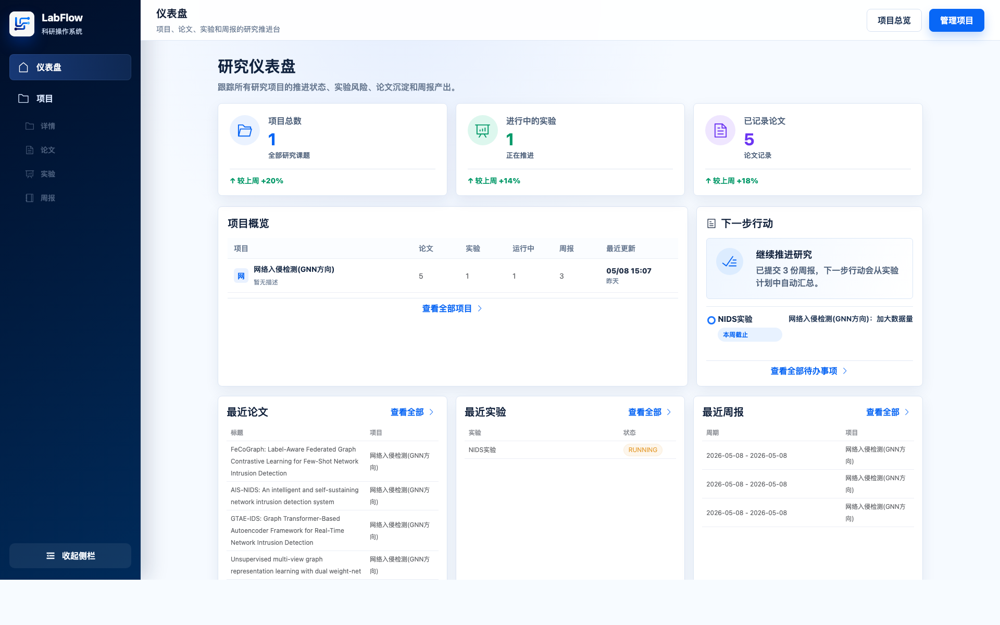
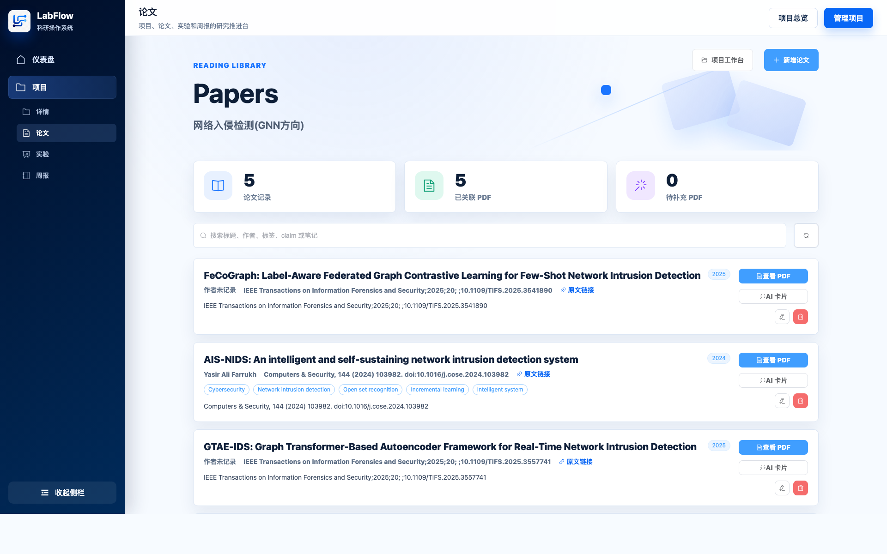
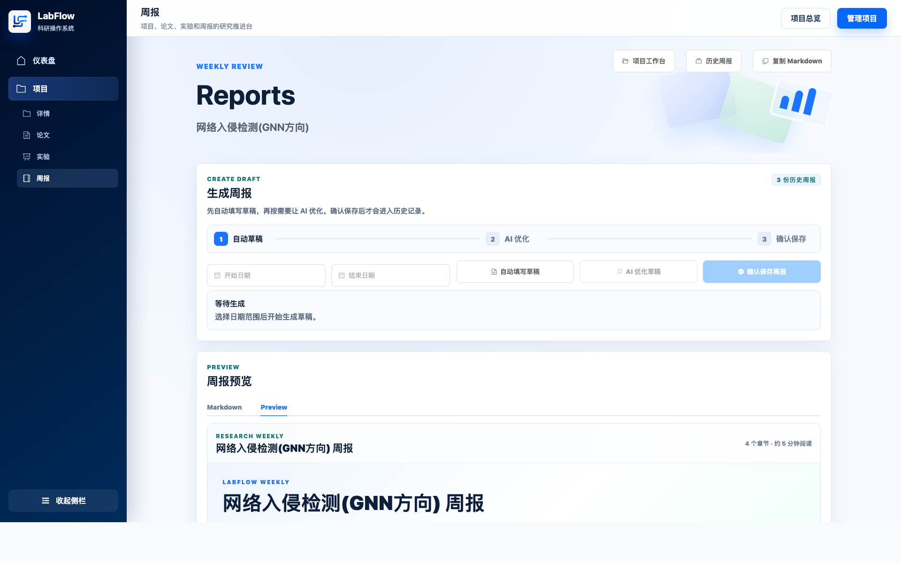
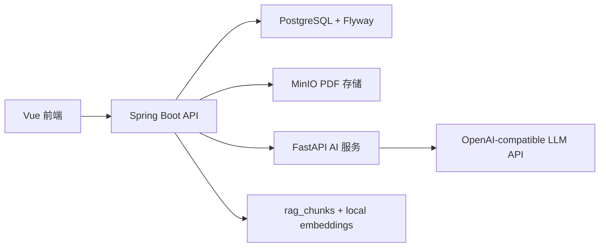

# LabFlow

LabFlow 是一个面向研究生和小型实验室的开源科研工作流系统。它把研究项目、论文/PDF 管理、实验记录、AI 论文卡片和 Markdown 周报生成整合到一个本地可运行、后续可扩展的 Research OS 中。

> 当前状态：v0.2 风格开发版本。核心闭环已经可以本地运行，适合继续开源迭代。



## 为什么做 LabFlow

很多研究生和小型实验室的科研过程分散在多个工具里：PDF 文件夹、Zotero、Excel、Obsidian/Notion、GitHub、实验日志和周报文档。LabFlow 的目标不是一开始做复杂的企业系统，而是先把科研工作中最常见、最容易断裂的流程连起来。

LabFlow 当前聚焦一个最小但完整的闭环：

1. 创建研究项目。
2. 导入和管理论文。
3. 上传 PDF，并保存到对象存储。
4. 记录实验配置、指标、结论和下一步计划。
5. 根据论文和实验生成可编辑的周报草稿。
6. 在配置 API Key 后，用 AI 生成论文卡片或优化周报。

## 项目截图

### 论文库



### 周报工作台



更多截图见 [`showcase/`](showcase/)。

## 功能特性

- 研究仪表盘：展示项目进度、最近论文、最近实验、最近周报和下一步行动。
- 项目管理：支持创建、查看、编辑和删除研究项目。
- 论文管理：支持标题、作者、出版物、日期、URL、关键词/标签、关键 claim 和笔记。
- PDF 拖拽识别：上传 PDF 后自动抽取基础元信息。
- Zotero 文本识别：支持从 BibTeX/RIS 风格文本中提取论文信息。
- MinIO PDF 存储：PDF 文件存入 MinIO，PostgreSQL 只保存元数据和 object key。
- PDF 替换与删除：编辑论文时可以替换 PDF，旧 MinIO 对象和文件元数据会被清理。
- 实验记录：支持状态、GitHub 仓库 URL、commit/branch/tag 说明、数据集、配置、指标、结论、失败原因和下一步。
- 周报生成：支持自动填写草稿、Markdown 编辑、AI 优化草稿、确认后保存历史记录。
- AI 论文卡片：支持摘要、主要贡献、局限性、缓存、任务状态和异步执行。
- 项目内 RAG：支持把论文、PDF 文本、AI 论文卡片和实验记录索引成知识片段，并进行研究问答。
- AI 服务：FastAPI 服务支持 mock 模式，也支持 OpenAI-compatible API。
- 数据库：仅支持 PostgreSQL，使用 Flyway 管理迁移，并预留 pgvector migration。
- 本地部署：提供 Docker Compose，一次启动 PostgreSQL、MinIO、后端、前端和 AI service。

## 技术栈

| 模块 | 技术 |
| --- | --- |
| 后端 | Java 17, Spring Boot 3.5.x, Maven, Spring Web, Spring Data JPA, Validation, Flyway, SpringDoc OpenAPI |
| 前端 | Vue 3, TypeScript, Vite, Vue Router, Pinia, Element Plus, Axios, markdown-it |
| AI 服务 | Python, FastAPI, Pydantic, httpx, OpenAI-compatible Chat Completions API |
| 数据库 | PostgreSQL only, pgvector planned |
| 文件存储 | MinIO |
| 测试 | JUnit, Spring Boot tests, H2-backed service tests, Testcontainers migration skeleton |

## 目录结构

```text
labflow/
├── apps/
│   ├── api/                 # Spring Boot 后端
│   ├── web/                 # Vue 3 前端
│   └── ai-service/          # FastAPI AI 服务
├── infra/
│   └── docker-compose.yml
├── scripts/
│   └── seed-demo-data.sh
├── docs/
│   ├── architecture.md
│   └── roadmap.md
├── showcase/                # GitHub / 作品集展示截图
├── AGENTS.md
├── DESCRIPTION.md
├── README.md
├── .gitignore
└── LICENSE
```

## 系统架构



- Spring Boot API 是项目、论文、实验、文件、周报和 AI job 的数据入口。
- PostgreSQL 保存结构化元数据和生成结果，不保存 PDF 二进制内容。
- MinIO 保存上传的 PDF 对象，`stored_files` 表保存 object key 和文件元数据。
- AI job 会落库，并由后端异步执行，前端通过轮询查看状态。
- AI service 可以使用 mock 响应，也可以调用 Kimi、OpenAI 或其他兼容 OpenAI API 的模型服务。
- RAG v0.3 先使用段落优先 chunking 和后端本地确定性 embedding，保证不配置 embedding API 也能跑；schema 已预留 pgvector 列，后续可以替换成真实向量模型。

## 本地开发

### 环境要求

- Java 17
- Maven
- Node.js 20+
- Python 3.12+ 推荐
- PostgreSQL，推荐使用带 pgvector 的镜像
- MinIO，或者直接使用 Docker Compose

### 1. 启动 PostgreSQL 和 MinIO

最简单的方式是使用 Docker Compose：

```bash
cd infra
docker compose up postgres minio
```

默认数据库配置：

```text
database: labflow
username: labflow
password: labflow
port: 5432
```

### 2. 启动后端

```bash
cd apps/api
cp .env.example .env
mvn spring-boot:run
```

后端会通过 Spring Boot config import 读取 `apps/api/.env`。你也可以用真实环境变量覆盖这些配置。

常用后端环境变量：

```bash
SERVER_PORT=8080
SPRING_DATASOURCE_URL=jdbc:postgresql://localhost:5432/labflow
SPRING_DATASOURCE_USERNAME=labflow
SPRING_DATASOURCE_PASSWORD=labflow
AI_SERVICE_BASE_URL=http://localhost:8000
AI_SERVICE_MOCK_ENABLED=false
MINIO_ENDPOINT=http://localhost:9000
MINIO_ACCESS_KEY=labflow
MINIO_SECRET_KEY=labflow-secret
MINIO_BUCKET=labflow
```

### 3. 启动 AI 服务

```bash
cd apps/ai-service
cp .env.example .env
python3 -m venv .venv
source .venv/bin/activate
pip install -r requirements.txt
uvicorn app.main:app --reload --port 8000
```

`.env.example` 默认启用 mock 模式。如果需要调用真实大模型 API，可以修改：

```bash
LABFLOW_AI_MOCK_ENABLED=false
LABFLOW_AI_OPENAI_API_KEY=your_api_key
LABFLOW_AI_OPENAI_BASE_URL=https://api.openai.com/v1
LABFLOW_AI_OPENAI_MODEL=gpt-4o-mini
LABFLOW_AI_OPENAI_TEMPERATURE=0.7
LABFLOW_AI_REQUEST_TIMEOUT_SECONDS=180
```

如果你使用 Kimi 或其他兼容 OpenAI 协议的服务，只需要替换 `LABFLOW_AI_OPENAI_BASE_URL` 和 `LABFLOW_AI_OPENAI_MODEL`。

### 4. 启动前端

```bash
cd apps/web
npm install
npm run dev
```

前端默认访问 `http://localhost:8080`。如需覆盖 API 地址：

```bash
VITE_API_BASE_URL=http://localhost:8080 npm run dev
```

### 5. 写入演示数据

后端启动后，可以运行：

```bash
./scripts/seed-demo-data.sh
```

如果 API 地址不同：

```bash
API_BASE_URL=http://localhost:8080 ./scripts/seed-demo-data.sh
```

## Docker Compose 启动

启动完整栈：

```bash
cd infra
docker compose up --build
```

服务地址：

| 服务 | 地址 |
| --- | --- |
| 前端 | `http://localhost:5173` |
| 后端 API | `http://localhost:8080` |
| Swagger UI | `http://localhost:8080/swagger-ui.html` |
| AI service | `http://localhost:8000` |
| MinIO console | `http://localhost:9001` |
| PostgreSQL | `localhost:5432` |

Compose 默认使用 `pgvector/pgvector:pg16`，因此 `CREATE EXTENSION IF NOT EXISTS vector;` 迁移可以正常执行。

## 主要 API

| 模块 | API |
| --- | --- |
| 健康检查 | `GET /api/health`, AI service 的 `GET /health` |
| 仪表盘 | `GET /api/dashboard` |
| 项目 | `GET/POST /api/projects`, `GET/PUT/DELETE /api/projects/{projectId}` |
| 论文 | `GET/POST /api/projects/{projectId}/papers`, `GET/PUT/DELETE /api/papers/{paperId}` |
| 论文 PDF | `POST /api/papers/{paperId}/pdf/upload`, `GET /api/files/{fileId}/inline`, `GET /api/files/{fileId}/download` |
| 论文识别 | `POST /api/projects/{projectId}/papers/recognize/pdf`, `POST /api/projects/{projectId}/papers/recognize/zotero` |
| 实验 | `GET/POST /api/projects/{projectId}/experiments`, `GET/PUT/DELETE /api/experiments/{experimentId}` |
| 周报 | `POST /api/projects/{projectId}/reports/weekly/preview`, `POST /api/projects/{projectId}/reports/weekly`, `GET /api/projects/{projectId}/reports` |
| AI jobs | `POST /api/ai/jobs`, `GET /api/ai/jobs/{jobId}`, `GET /api/ai/jobs/latest`, `GET /api/ai/jobs/latest-any` |
| RAG | `POST /api/projects/{projectId}/rag/index`, `GET /api/projects/{projectId}/rag/chunks`, `POST /api/projects/{projectId}/rag/search`, `POST /api/projects/{projectId}/rag/ask` |

## 验证命令

后端：

```bash
cd apps/api
mvn test
```

前端：

```bash
cd apps/web
npm run build
```

AI 服务：

```bash
cd apps/ai-service
python3 -m compileall app
```

Docker Compose 配置：

```bash
cd infra
docker compose config
```

## 数据库说明

LabFlow 当前只支持 PostgreSQL，不支持 MySQL。

这是一个有意的取舍：

- 后续 RAG 和向量检索会使用 pgvector。
- PostgreSQL 对事务、扩展、文本、UUID 和 timestamptz 的支持更适合当前路线。
- 避免同时支持 MySQL 可以让早期 schema、migration 和测试保持简单。
- PDF 不会直接存进数据库，PDF 二进制内容存储在 MinIO，数据库只保存元数据和 object key。

## 路线图

### v0.2

- 更强的 PDF 元数据抽取。
- 基于 PDF 片段的 AI 论文卡片。
- 文件管理页面。
- GitHub repository / commit 关联。
- 更好的周报模板。

### v0.3

- 项目内 RAG 知识库。
- 论文、PDF 文本、AI 论文卡片和实验记录索引。
- RAG 研究问答页。
- 带引用依据的论文摘要。
- PDF 章节解析。
- LangChain / LangGraph 工作流。
- 更完善的 AI job 重试和可观测性。

### v0.4

- 生产级 embedding provider。
- 基于 pgvector 的近邻检索。
- Hybrid retrieval。
- 实验结果和论文 claim 的关联。

### v1.0

- 稳定开源版本。
- 演示数据和演示部署流程。
- 完整文档。
- 可选的用户/团队支持。

## License

LabFlow 使用 MIT License。详见 [LICENSE](LICENSE)。
